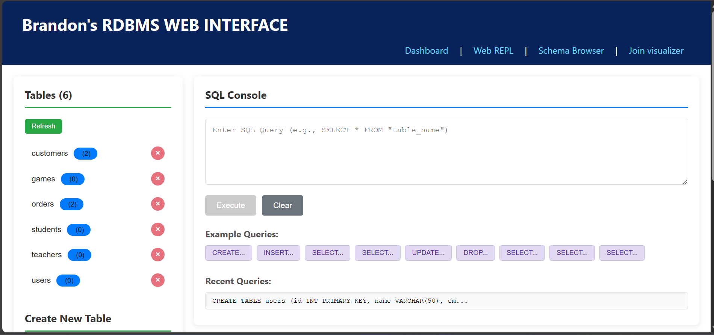
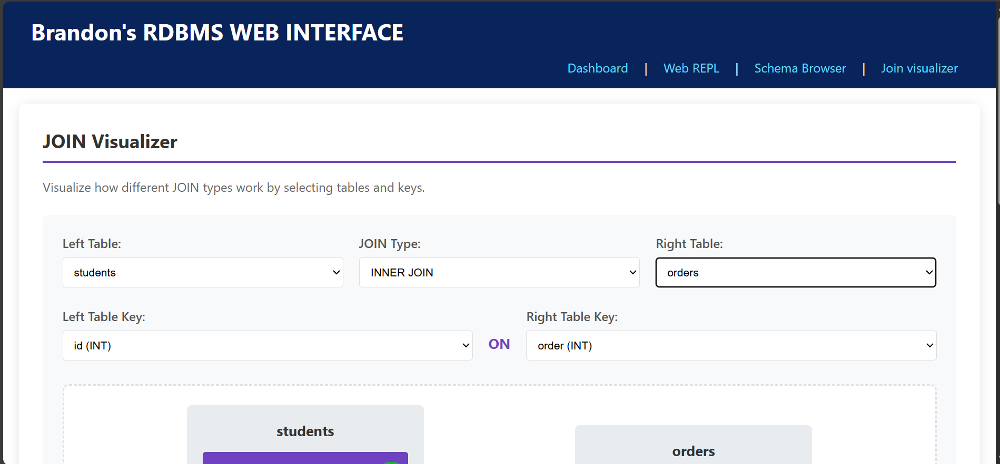
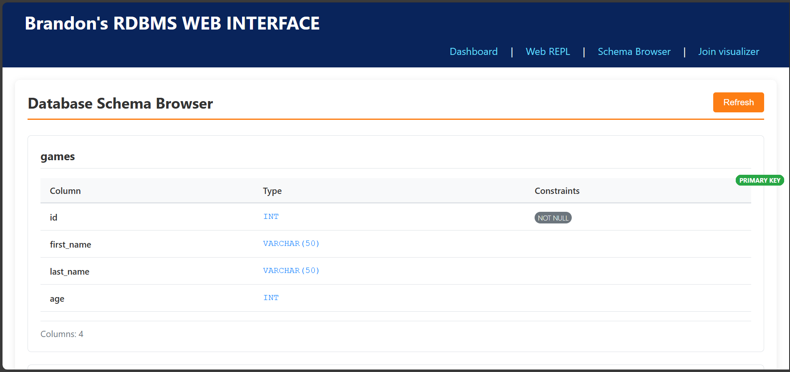
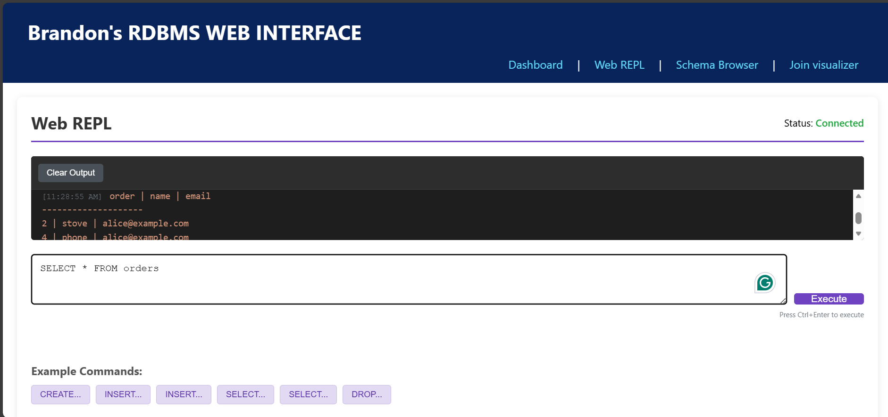

# Brandon's RDBMS - A Minimal Relational Database Management System




A fully-featured relational database management system built from scratch with SQL parser, storage engine, indexing, and web interface.

## Features

### **Core Database Engine**
- **SQL Parser**: Custom SQL parser supporting CREATE, SELECT, INSERT, UPDATE, DELETE
- **Data Types**: INT, VARCHAR, BOOLEAN, DATE with constraints
- **CRUD Operations**: Full Create, Read, Update, Delete support
- **Indexing**: Hash-based indexing for primary keys and unique constraints
- **JOIN Operations**: INNER JOIN, LEFT JOIN, RIGHT JOIN with visual builder
- **Constraints**: PRIMARY KEY, UNIQUE, NOT NULL validation
- **File-based Storage**: Persistent storage with schema files

### **Web Interface**
- **Interactive SQL Console**: Run SQL queries with syntax highlighting
- **Table Manager**: Create, browse, and drop tables visually
- **JOIN Visualizer**: Interactive JOIN builder with Venn diagrams
  
- **Schema Browser**: View table schemas and constraints
  
- **Web REPL**: Real-time SQL console via WebSocket
  
- **Responsive Design**: Works on desktop and mobile

###  **APIs & Interfaces**
- **REST API**: Full CRUD operations via HTTP/JSON
- **WebSocket REPL**: Real-time SQL execution
- **Command-line REPL**: Traditional SQL interface
- **React Frontend**: Modern, responsive UI

##  Requirements Met

| Requirement | Status | Notes |
|------------|--------|-------|
| SQL Interface | ✅ Complete | CREATE, SELECT, INSERT, UPDATE, DELETE |
| Data Types | ✅ Complete | INT, VARCHAR, BOOLEAN, DATE |
| Table Declaration | ✅ Complete | With constraints |
| CRUD Operations | ✅ Complete | Full implementation |
| Primary Key | ✅ Complete | Constraint validation |
| Unique Key | ✅ Complete | Constraint validation |
| Basic Indexing | ✅ Complete | Hash indexes |
| **JOIN Operations** | ✅ **Complete** | **INNER, LEFT, RIGHT JOIN** |
| Interactive REPL | ✅ Complete | CLI and Web versions |
| Web App Demo | ✅ Complete | Full-stack React/Flask app |

## 🛠️ Tech Stack

**Backend:**
- Python 3.8+
- Flask (REST API)
- Flask-SocketIO (WebSocket REPL)
- Custom SQL Parser
- File-based Storage Engine

**Frontend:**
- React 18
- React Router
- Socket.IO Client
- CSS3 with Flexbox/Grid

## 🚀 Quick Start

### **Local Development**


1. **Clone and install:**
```bash
git clone https://github.com/muk-e-ni/RDBMS-
cd RDBMS-
pip install -r requirements.txt
cd frontend
npm install
